# Diagrammes UML

Diagrammes de DBox, en [Mermaid](https://mermaid.js.org) : Forgejo et GitHub les
affichent directement, et ils restent du texte, relu et versionné comme le code.
Ils illustrent le [dossier d'architecture](ARCHITECTURE.md), qui y renvoie par
numéro.

Les noms de types et de fonctions sont ceux du code (`src/`). Un diagramme qui
contredit le code est faux : c'est le code qui fait foi.

| # | Diagramme | Type UML |
| --- | --- | --- |
| 1 | [Contexte](#1-contexte) | Cas d'utilisation / contexte |
| 2 | [Composants et dépendances](#2-composants-et-dépendances) | Composants |
| 3 | [Modèle du domaine](#3-modèle-du-domaine) | Classes |
| 4 | [`dbox up`](#4-séquence--dbox-up) | Séquence |
| 5 | [Redéployer depuis le tableau de bord](#5-séquence--redéployer-depuis-le-tableau-de-bord) | Séquence |
| 6 | [Gardes d'une requête HTTP](#6-séquence--gardes-dune-requête-http) | Séquence |
| 7 | [Déploiement continu du daemon](#7-séquence--déploiement-continu-du-daemon) | Séquence |
| 8 | [Cycle de vie d'une tâche](#8-états--une-tâche-job) | États |
| 9 | [État d'une cible](#9-états--une-cible) | États |
| 10 | [Un passage de `maj-auto.sh`](#10-activité--un-passage-de-maj-autosh) | Activité |
| 11 | [Le registre sur le disque](#11-le-registre-sur-le-disque) | Objets / données |
| 12 | [Déploiement physique](#12-déploiement) | Déploiement |
| 13 | [Décisions de `up()`](#13-activité--up) | Activité |

---

## 1. Contexte

Qui utilise DBox, et avec quels systèmes il parle.

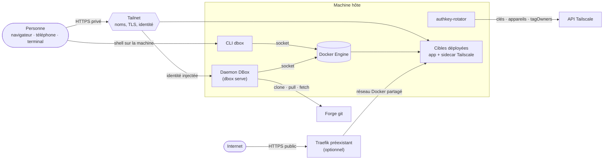

## 2. Composants et dépendances

Les flèches suivent les `import` réels de `src/`. Seuls les modules du noyau
pur n'en ont aucun vers les adaptateurs.

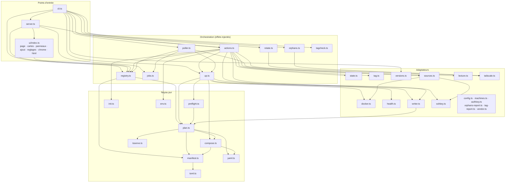

## 3. Modèle du domaine

Les types centraux. `Target` est une **union discriminée** par `mode` : chaque
variante ne porte que les champs qui ont un sens pour elle (pas de
`publicDomain` ni de compagnons en `workspace`, pas d'`autoDeploy` non plus).

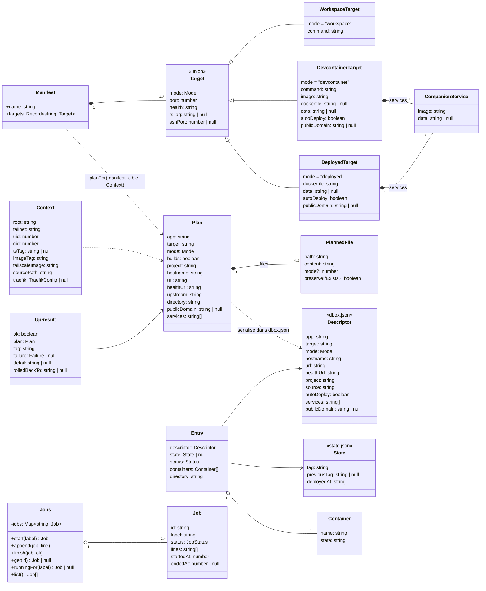

Les interfaces de dépendances, injectées par `cli.ts` et remplacées par des
doublures dans les tests :

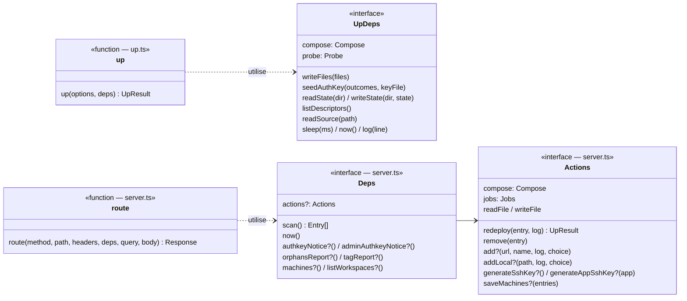

## 4. Séquence — `dbox up`

Le chemin nominal, puis les deux échecs qui comptent. Un échec de construction
s'arrête **avant** `up -d` : la version en place continue de tourner.

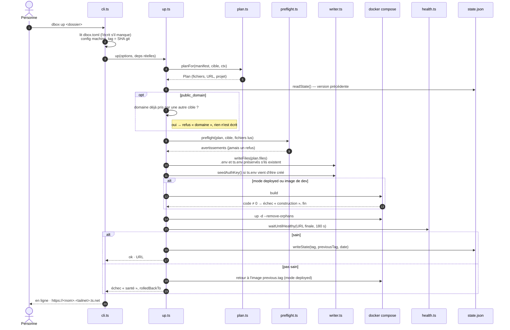

## 5. Séquence — redéployer depuis le tableau de bord

Un redéploiement dure des minutes : la requête rend tout de suite un fragment
qui suit une **tâche**, et htmx interroge cette tâche jusqu'à la fin.

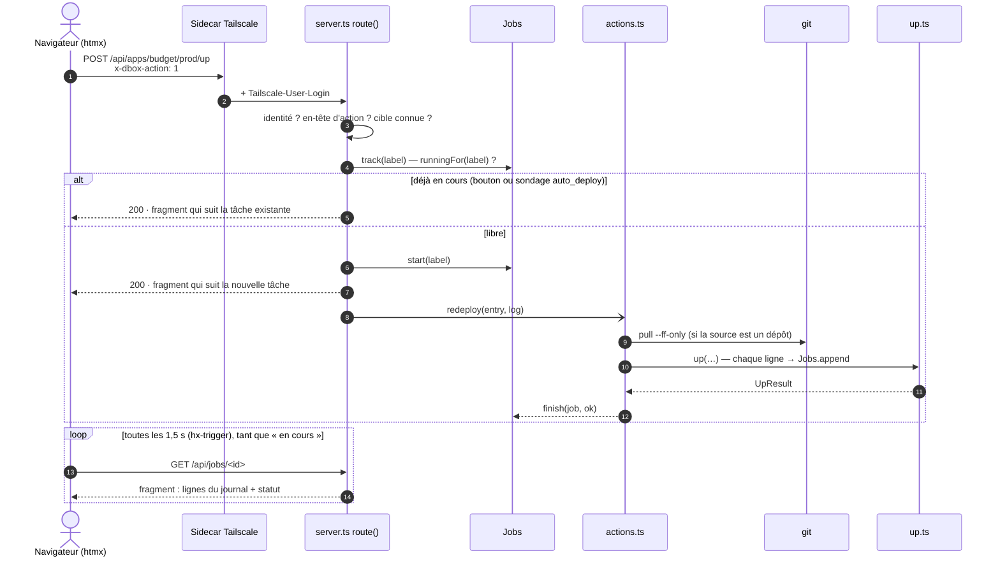

## 6. Séquence — gardes d'une requête HTTP

L'ordre des contrôles dans `route()`. Les erreurs de protocole gardent leur code
HTTP ; une action qui échoue répond 200 avec le résultat dans le HTML.

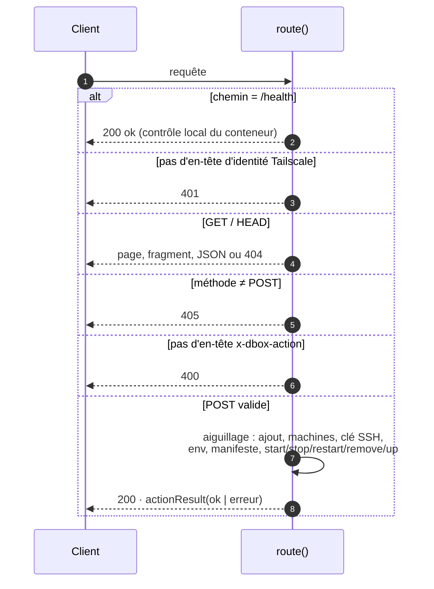

## 7. Séquence — déploiement continu du daemon

Personne ne pousse vers les machines : elles tirent.

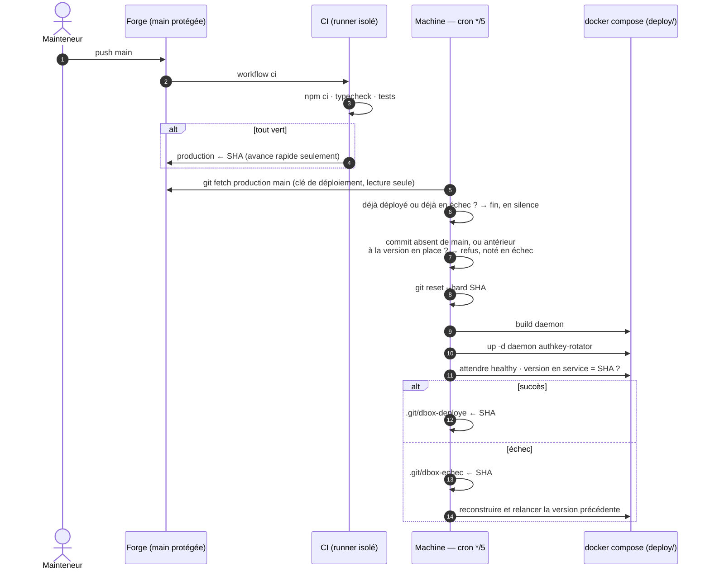

## 8. États — une tâche (`Job`)

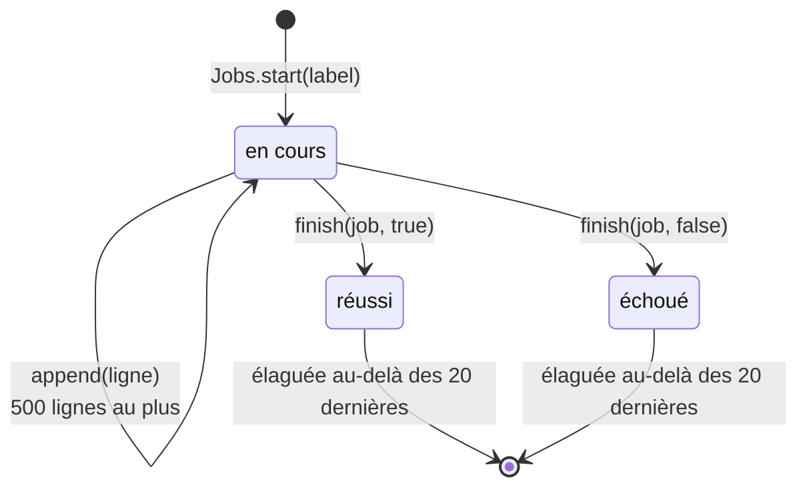

Une tâche vit en mémoire : un redémarrage du daemon l'efface. La vérité durable
— quelle version tourne — reste `state.json`.

## 9. États — une cible

Le statut affiché est **calculé** à chaque lecture (`statusOf`), à partir des
conteneurs du projet Compose ; il n'est stocké nulle part.

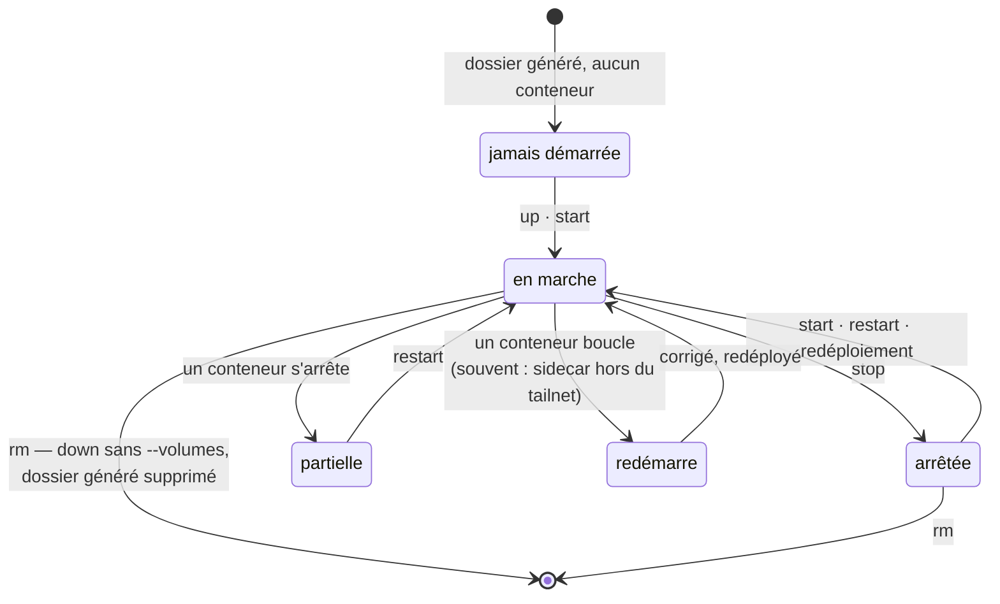

| Règle (`registry.ts`) | Statut |
| --- | --- |
| aucun conteneur | jamais démarrée |
| au moins un `restarting` | redémarre |
| tous `running` | en marche |
| aucun `running` | arrêtée |
| sinon | partielle |

## 10. Activité — un passage de `maj-auto.sh`

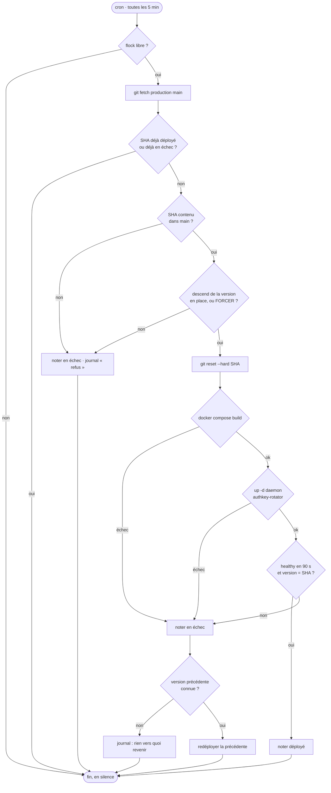

## 11. Le registre sur le disque

Pas de base de données : chaque dossier de cible est auto-descriptif.

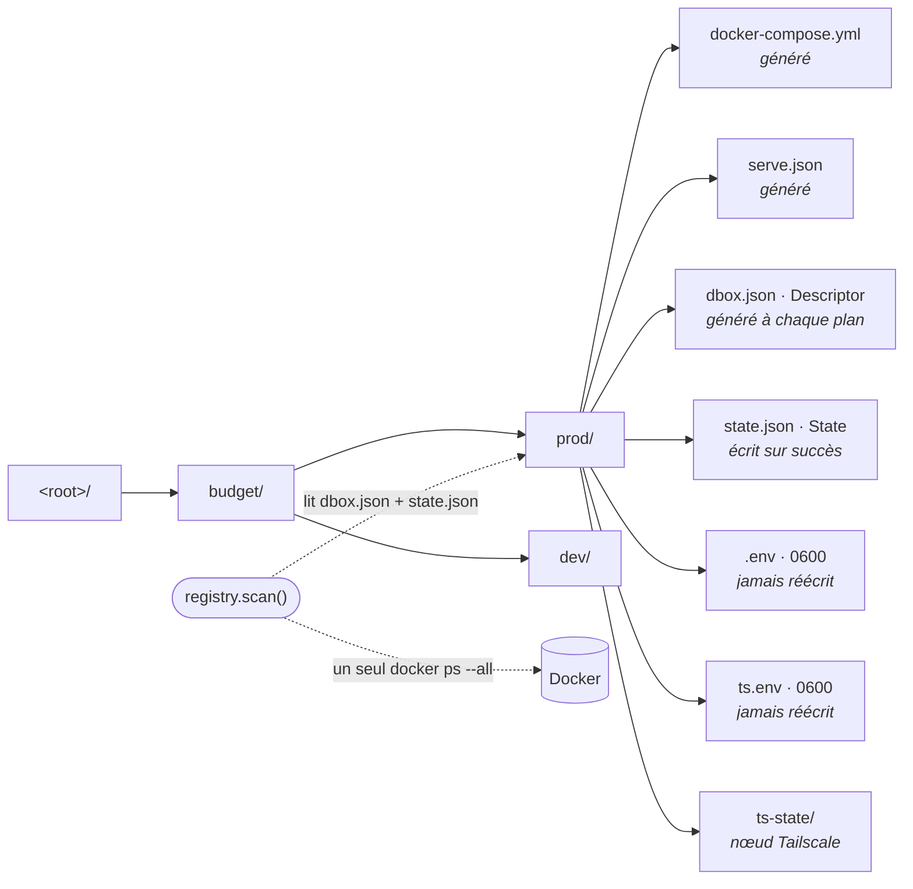

## 12. Déploiement

Deux machines, chacune autonome. Les noms d'hôte (`dbox`, `dbox-dev`) viennent de
`DBOX_HOSTNAME` ; la cible gérée, de `target` dans la configuration de la machine.

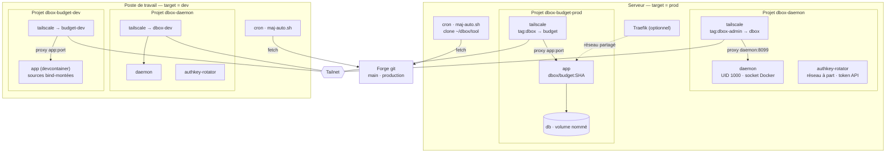

## 13. Activité — `up()`

Toutes les décisions de `up.ts`, dans l'ordre où le code les prend.

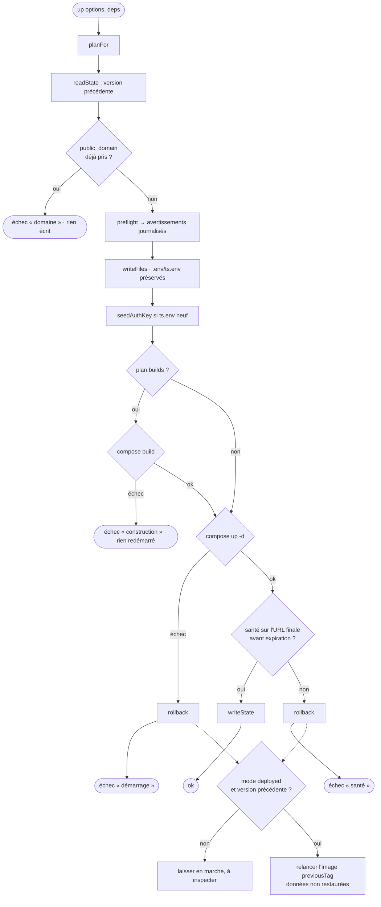
